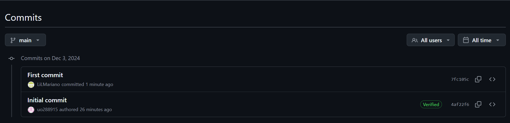
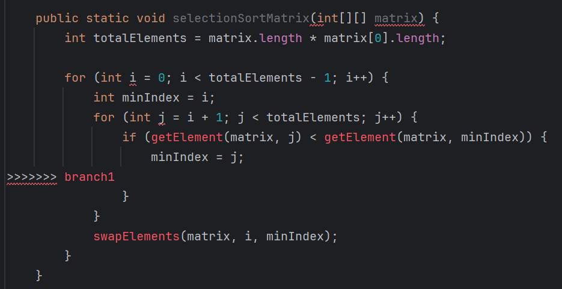
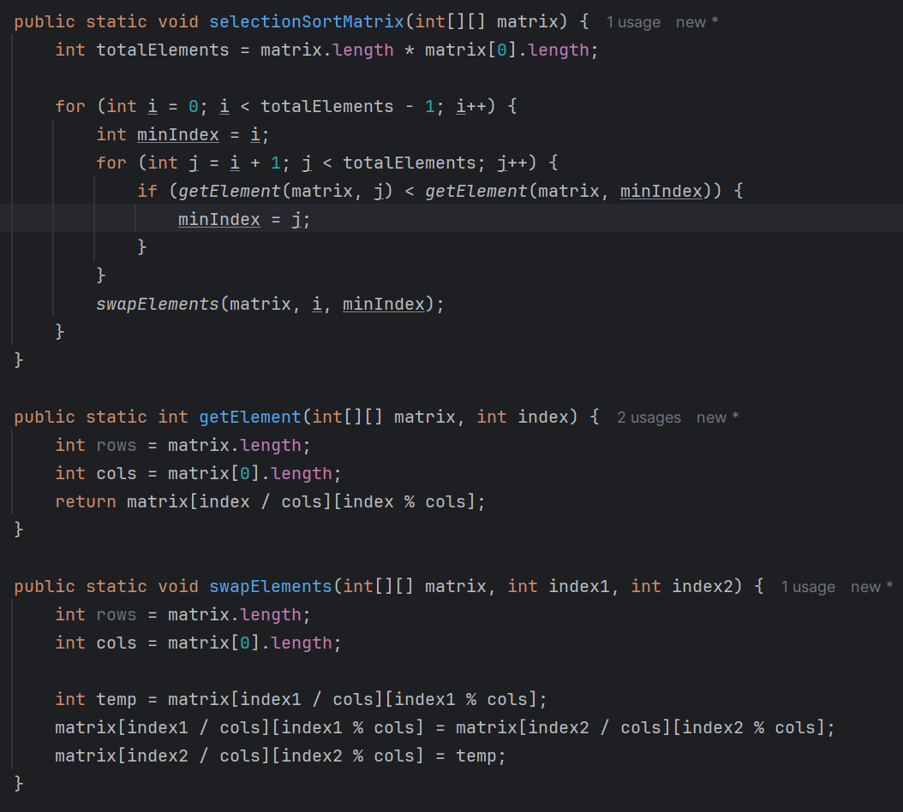

# REPORT - GIT

**Name:** Martín Felgueres Díaz
**Subject:** Software Development Tools  
**Date:** 5 of december of 2024

---

## Crear un repositorio remoto (en GitHub, ...)

## Clonar el repositorio vacío (git clone)

We click in the option of clone repository and we write the URL of the repository that we have created at GitHub.

When we loaded the project it looked something like this:

## Crear en la carpeta del repositorio local un proyecto vacío utilizando el lenguaje elegido

This is the route of the project at the local machine:

## Hacer commit de todo el proyecto en el repositorio (git commit -m "message ...")

In GitHub we can see every commits.

## Agregar código simple al proyecto Java/C++/C# (por ejemplo, crear tabla, escribir elementos de la tabla)

We write Java code:

## Hacer commit de los cambios

We click on commit and push the changes.

## Agregar más código (por ejemplo, inicializar tabla con valores aleatorios)

As in the previous section I would have already initialized a 4x4 matrix with random values, now I initialize a 40x40 one and if the number is prime I set it to 0.

## Hacer commit de los cambios

We click on commit and push the changes.

## Agregar más código (por ejemplo, ordenar elementos de la tabla)

## Hacer commit de los cambios

We click on commit and push the changes.

## Consultar el historial de código (git log)

## Consultar anotaciones del código (git blame)

## Intentar checkout de diferentes revisiones (git checkout)

We check de hash of one of our last commits.

We do a checkout with this hash.

We can see the changes at Main.java.

We come to the last commit.

## Agregar cambios al código, pero no hacer commit

I add this line to the code.

## Intentar revertir los últimos cambios (git revert)

We want to revert the last commit so we will do a git revert using the second hash.

We can see that is impossible to do a git revert while there are some changes that you haven’t committed.

## Subir el proyecto al repositorio remoto (git push)

We click on commit and push changes.

## r) Eliminar el proyecto local y el repositorio local

## s) Clonar el proyecto desde el repositorio remoto (git clone)

## t) Crear una etiqueta/release y probar cambiar entre esta etiqueta y la rama master (git branch, git tag)

We create a tag with name v1.

We switch to v1 and then to main.

## u) Crear una nueva rama a partir de la rama master

## w) Cambiar a la nueva rama (git merge)

## x) Mejorar el código en la nueva rama (por ejemplo, cambiar el algoritmo de ordenamiento)

The condition is to be a prime number and bigger than 50.

We commited and push into the branch1.

## y) Fusionar la nueva rama con la rama master

And now we will merge this branch into master. For this we have to be in master branch and then make de merge with the branch.

If we go to GitHub we can see that the branch1 had recent pushes, so GitHub will give us the possibility to make a pull request which is a way to merge the content of one branch to another, seeing in detail what is being modified and whether there are conflicts or not and if so, being able to solve them manually.

We click on compare and pull request and we see this:

Here we can see what we will modify into the master branch. In this case I just modify the condition to initialize a number of the matrix to 0. The red color is what was in the master branch. And green what is new. In this case we don’t have to solve any conflicts.

We create the pull request:

And the branch1 was merged into master.

Now we see the code of master branch and we can see the change:

## z) Compartir la URL del repositorio con un amigo (asegurarse de dar acceso primero)

We enter in another account and we can accept the invitation.

## z1) Intentar producir un conflicto

We go to branch1.

We modify several lines of code trying to create conflicts.

What I had before have modified.

The result of modification.

We have to committed the changes in branch1 and go to master branch, now we can do a merge with branch1. We can see that some conflicts have happened.

The conflicts:

## z2) Resolver el conflicto y subir la solución al repositorio remoto

I solved the manually:

Now we can merge branch1 into master branch.

## z3) Enviar la URL del repositorio al profesor junto con un informe breve (no olvidar establecer acceso para el profesor)
